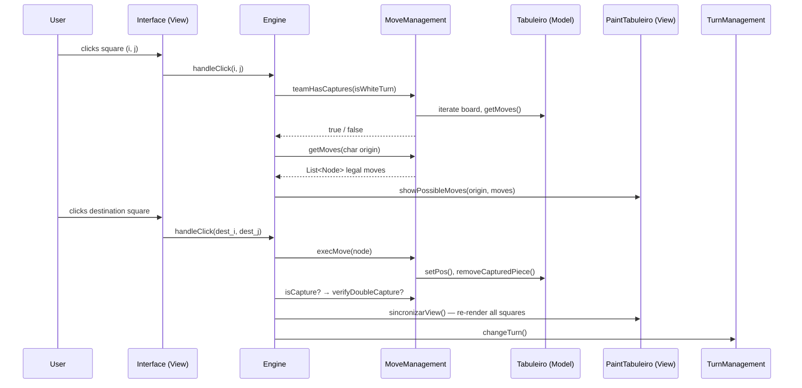
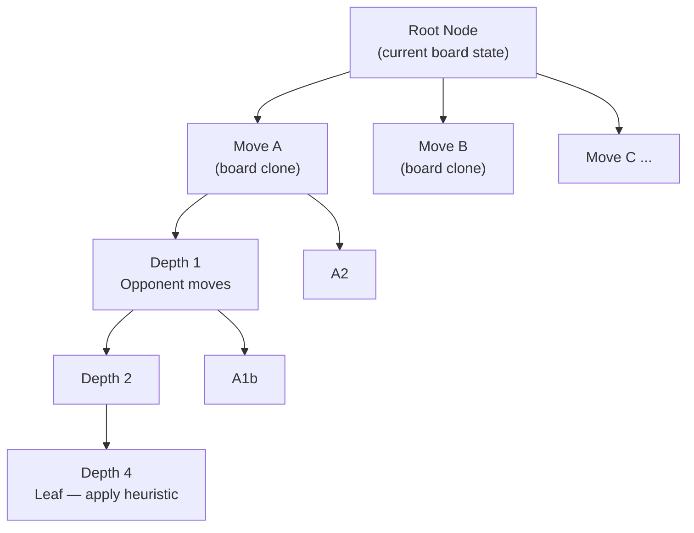

# Checkers Intelligence

> A Java-based Checkers (Draughts) game on a 6×6 board with an AI engine built for an Artificial Intelligence course — featuring game tree construction (Minimax-ready), full move validation, king promotion, mandatory capture rules, and a Swing GUI.

---

## 🎮 Overview

**Checkers Intelligence** is an academic AI project that implements a fully playable Checkers game on a reduced 6×6 board. The project focuses on two main goals:

1. **A complete, rule-compliant game engine** — handling all classic Checkers rules including mandatory capture, multi-jumps, king promotion, and turn management.
2. **An AI game-tree foundation** — the `Tree` class constructs a lookahead game tree (depth-4) by cloning board states and expanding all legal moves, ready to be driven by a Minimax (or Alpha-Beta) decision algorithm.

**Key features:**
- Interactive 6×6 graphical board using Java Swing
- Click-to-select UI with visual feedback (yellow = selected, gray = valid moves, red = capturable enemies)
- Full king movement and multi-capture support
- Mandatory capture enforcement (player must capture if a capture is available)
- Piece promotion to King on reaching the opposite back rank
- Game tree construction for AI lookahead (depth configurable)
- Fun easter-egg: earn a free piece by watching an IF college promo video when down to your last piece

**Screenshot placeholder:**

> *(Add a screenshot of the running game here)*
> ``

---

## 🏗️ Architecture

### High-Level Design

The project is structured around three classic layers — **Model**, **View**, and **Engine** — plus a dedicated **AI** package:

```
┌─────────────────────────────────────────────────────┐
│                      View Layer                     │
│   Interface (JFrame) · PaintTabuleiro · CasaBotao   │
│                         PopUp                       │
└────────────────────────┬────────────────────────────┘
                         │ events / render calls
┌────────────────────────▼────────────────────────────┐
│                    Engine Layer                     │
│  Engine (coordinator) · MoveManagement              │
│  TurnManagement · PromotionManagement · Translator  │
└────────────────────────┬────────────────────────────┘
                         │ reads / writes
┌────────────────────────▼────────────────────────────┐
│                     Model Layer                     │
│           Tabuleiro (board) · Position · Node       │
└─────────────────────────────────────────────────────┘
                         ▲
┌────────────────────────┴────────────────────────────┐
│                      AI Layer                       │
│     Tree (game-tree builder, Minimax-ready)         │
└─────────────────────────────────────────────────────┘
```

### Core Components and Responsibilities

| Class | Package | Responsibility |
|---|---|---|
| `Main` | root | Entry point; wires together `Tabuleiro`, `CasaBotao[][]`, `Engine`, and `Interface` using `SwingUtilities.invokeLater` |
| `Tabuleiro` | Model | 6×6 `char[][]` board. Holds piece constants (`0`–`4`), initialization, cloning, boundary checks, and piece-type queries (`isEmpty`, `isWhite`, `isEnemy`, `isDama`) |
| `Position` | Model | Row/column value object with proper `equals`/`hashCode` (required for `HashMap` keying in `Translator`) |
| `Node` | Model | Represents a move as `(origin char, dest char)` plus optional board snapshot and MinMax score. Also used as a tree node (holds `ArrayList<Node> children`) |
| `Engine` | Engine | Central coordinator. Handles all click events, enforces game rules (mandatory capture, multi-capture continuation, game-over detection), and delegates to sub-managers |
| `MoveManagement` | Engine | Computes all legal moves for a piece (simple or king), executes moves on the board, removes captured pieces, and detects capture moves |
| `TurnManagement` | Engine | Tracks and alternates turns; detects game over (a player has 0 pieces) |
| `PromotionManagement` | Engine | Promotes a piece to King when it reaches the opposite back rank |
| `Translator` | Engine | Bidirectional HashMap that maps dark squares to alphabetic chars (`A`–`R`) and back to `Position` objects. This encoding is used throughout the engine for compact move representation |
| `GameOverListener` | Engine | Functional interface; callback invoked when the game ends — implemented by `Interface::declararVencedor` |
| `Interface` | View | `JFrame` with a 6×6 `GridLayout`. Attaches click listeners only to dark squares. Renders the winner dialog |
| `PaintTabuleiro` | View | Colours squares (beige/green base; yellow = selected; gray = valid move; red = enemy to capture) and renders piece icons |
| `CasaBotao` | View | Custom `JButton` for each board square |
| `PopUp` | View | Easter-egg dialog: when white is down to 1 piece, offers a free piece in exchange for watching an IF college video |
| `Tree` | AI | Recursively builds a game tree up to depth 4. For each node, clones the `Tabuleiro`, executes the move, and stores the board state. Ready to be scored with a heuristic and traversed by Minimax |

### Data Flow — A Player Click



### AI Game Tree



The `Tree` class builds this structure by calling `montarArvoreIA(root, depth=0, tabuleiro, isWhiteTurn)` recursively. At each level it:
1. Collects all legal moves for the current side using `retornarJogadasPossiveis`.
2. Clones the board (`Tabuleiro.clone()`).
3. Executes the move on the clone.
4. Saves the board snapshot in the `Node`.
5. Recurses into children, flipping turn (unless a multi-capture continues).

The `Node.minMax` field is reserved for the Minimax score — the scoring heuristic and tree traversal are the next implementation step (see [Roadmap](#-roadmap)).

### Board Encoding

Only the 18 dark squares of the 6×6 board are playable. The `Translator` assigns each an alphabetic label:

```
  Col: 0    1    2    3    4    5
Row 0: .    A    .    B    .    C
Row 1: D    .    E    .    F    .
Row 2: .    G    .    H    .    I
Row 3: J    .    K    .    L    .
Row 4: .    M    .    N    .    O
Row 5: P    .    Q    .    R    .
```

A move is thus stored as two `char` values, e.g., `Node('M', 'G')` means "piece on M moves to G". This makes move representation compact and hashable.

### Piece Encoding

| Value (`char`) | Piece |
|:-:|:---|
| `'0'` | Empty square |
| `'1'` | White piece |
| `'2'` | Black piece |
| `'3'` | White king |
| `'4'` | Black king |

---

## 🚀 Getting Started

### Prerequisites

- **Java JDK 11 or higher** (Swing is included in the JDK — no extra libraries needed)
- **IntelliJ IDEA** (recommended — the project includes `.iml` and `.idea/` configuration) or any IDE / terminal with `javac`

Verify your Java installation:
```bash
java -version
javac -version
```

### Installation

```bash
# 1. Clone or extract the project
git clone <repository-url>
cd damas

# 2. Compile all source files from the project root
javac -d out/production/damas \
      src/Main.java \
      src/Model/*.java \
      src/Engine/*.java \
      src/View/*.java \
      src/AI/*.java

# 3. Run the application
java -cp out/production/damas Main
```

### Running from IntelliJ IDEA

1. Open IntelliJ IDEA → **File → Open** → select the `damas/` folder.
2. The `.iml` and `.idea/` files will be auto-detected.
3. Mark `src/` as the **Sources Root** if not already set.
4. Run `Main.java` (right-click → **Run 'Main.main()'**).

> **Note:** Pre-compiled `.class` files are already present in `out/production/damas/` and can be run directly with `java -cp out/production/damas Main` without recompiling.

---

## 🎯 How to Play

1. **White pieces** (bottom two rows) always move first.
2. **Click a piece** to select it — it highlights yellow, valid destination squares turn gray, and capturable enemy pieces turn red.
3. **Click a destination** to complete the move. Click the same piece again to deselect.
4. **Mandatory capture:** if any of your pieces can capture an enemy, you must capture — simple moves are blocked until captures are resolved.
5. **Multi-capture:** after capturing, if the same piece can capture again, it stays selected and you must continue jumping.
6. **Promotion:** a piece that reaches the opposite back rank becomes a King (moves in all 4 diagonal directions, any number of squares).
7. The game ends when one side has **0 pieces remaining**. A dialog announces the winner.

---

## 📁 Project Structure

```
damas/
├── src/
│   ├── Main.java                        # Application entry point
│   ├── Model/
│   │   ├── Tabuleiro.java               # Board representation (6×6 char matrix)
│   │   ├── Position.java                # (row, col) value object
│   │   └── Node.java                   # Move + tree node + board snapshot
│   ├── Engine/
│   │   ├── Engine.java                  # Central game coordinator / click handler
│   │   ├── MoveManagement.java          # Move generation and execution
│   │   ├── TurnManagement.java          # Turn alternation and game-over detection
│   │   ├── PromotionManagement.java     # King promotion logic
│   │   ├── Translator.java              # Square ↔ char bidirectional mapping
│   │   └── GameOverListener.java        # Functional interface for end-of-game callback
│   ├── View/
│   │   ├── Interface.java               # Main JFrame window
│   │   ├── PaintTabuleiro.java          # Board rendering and move highlighting
│   │   ├── CasaBotao.java               # Custom JButton for board squares
│   │   └── PopUp.java                   # Easter-egg promo popup
│   └── AI/
│       └── Tree.java                    # Game tree builder (depth-4, Minimax-ready)
├── out/production/damas/                # Pre-compiled .class files
├── heuristica.md                        # Developer notes on heuristic design
├── sugestoes.md                         # Course TODO lists and improvement ideas
├── Readme.md                            # Original README (superseded by this file)
├── damas.iml                            # IntelliJ module file
├── LICENSE                              # MIT License
└── .gitignore
```

---

## 🧠 AI Design Notes

The AI engine is under active development. The current state and planned improvements are documented below.

### Implemented: Game Tree Construction (`Tree.java`)

- Recursively expands all legal moves up to **depth 4**.
- Each node stores a full board clone (`Tabuleiro.clone()`), enabling independent evaluation at any tree level.
- Multi-capture sequences keep the same player's turn (turn is only flipped when no further capture is available after a jump).

### Heuristic Ideas (from `heuristica.md`)

Two heuristic strategies are under consideration:

**1. Material count heuristic (basic)**
Score = (AI pieces × 1 + AI kings × 2) − (Opponent pieces × 1 + Opponent kings × 2). Simple to implement, but can be fooled by positions where the opponent has a winning capture chain despite fewer pieces.

**2. Opponent mobility minimization**
Weight opponent moves by type (simple move = 1, capture = 2, king move = 3, king capture = 4). Prune tree branches where the opponent has the highest weighted mobility. Aims to corner the opponent, though it doesn't directly maximise AI advantage.

A combined heuristic blending both approaches is the planned next step.

### Planned: Minimax with Alpha-Beta Pruning

The `Node.minMax` field is reserved for the score assigned during tree traversal. The next implementation step is:

1. Implement a scoring heuristic function `evaluate(Tabuleiro, isWhite) → int`.
2. Walk the tree with Minimax: maximise on AI turns, minimise on opponent turns.
3. Add Alpha-Beta pruning to reduce the effective branching factor.
4. Optionally: increase tree depth or use iterative deepening with a time budget.

---

## 🗺️ Roadmap

The following improvements are planned (sourced from the course TODO lists in `sugestoes.md`):

- **Minimax implementation** — score and traverse the existing game tree.
- **Heuristic function** — implement material count heuristic as a baseline; explore mobility minimization.
- **Alpha-Beta pruning** — reduce tree size for deeper search.
- **Compact board representation** — encode board as an 18-character string or two piece-position vectors (one for white, one for black) for faster cloning and comparison.
- **Faster capture detection** — current team-level capture check is O(n²); optimize to O(n) with incremental updates.
- **Draw detection** — when only two kings remain and neither can capture, declare a draw.
- **Threaded tree construction** — build the AI tree in a background thread while the human player is thinking.
- **Incremental tree reuse** — after the human moves, reuse the subtree rooted at the chosen node instead of rebuilding from scratch.
- **Randomized play beyond depth 10** — for late-game positions, add randomization or restart the tree from the current state.

---

## 📜 Game Rules Reference

| Rule | Description |
|---|---|
| **Mandatory capture** | If any of your pieces can capture, you must capture — simple moves are blocked |
| **Forward-only capture** | Regular pieces can only capture in their forward direction |
| **Multi-capture** | After a capture, if the same piece can capture again, it must continue |
| **King movement** | A king can move any number of squares diagonally in any direction |
| **King capture** | A king can capture in any diagonal direction and continue multi-captures |
| **King landing** | After a king capture, the king lands immediately after the captured piece |
| **Promotion** | A piece that reaches the opposite back rank is immediately promoted to King |
| **Game over** | A player with 0 pieces remaining loses |

---

## 📄 License

This project is licensed under the **MIT License** — see the `LICENSE` file for full details.

---

## 👥 Contributing

This is an academic project. If you are extending it:

1. Fork the repository and create a feature branch.
2. Follow the existing package structure (`Model`, `Engine`, `View`, `AI`).
3. Add JavaDoc comments for any new public methods.
4. Test move generation and capture logic before submitting a pull request.

---

*Developed as part of an Artificial Intelligence course — Instituto Federal (IF), 2026.*