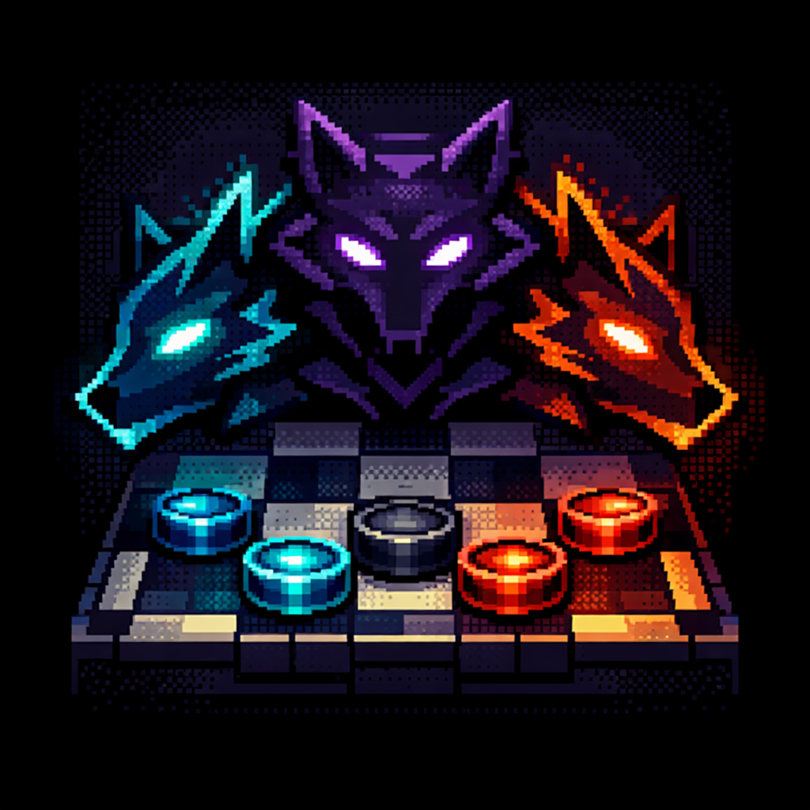
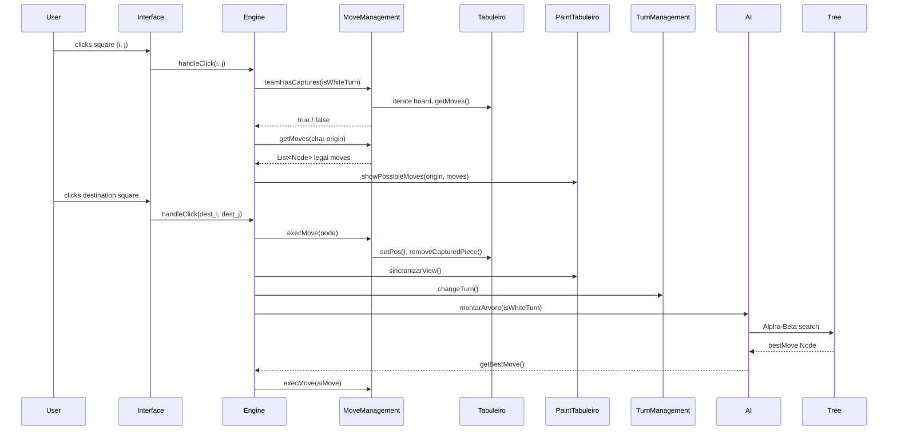
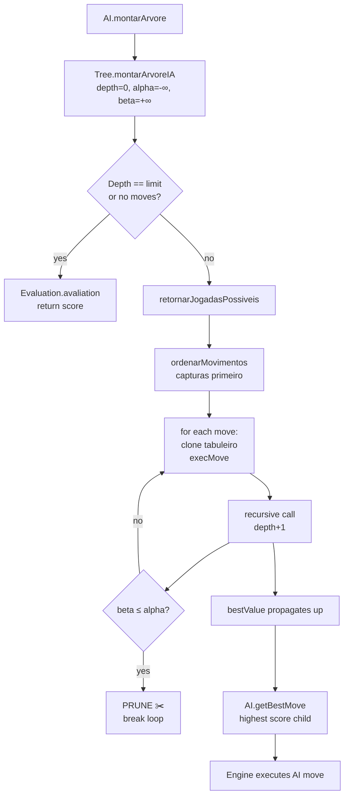

<div align="center">

```

███╗   ██╗ ██████╗ ██████╗ ███████╗███████╗
████╗  ██║██╔═══██╗██╔══██╗██╔════╝██╔════╝
██╔██╗ ██║██║   ██║██████╔╝███████╗█████╗  
██║╚██╗██║██║   ██║██╔══██╗╚════██║██╔══╝  
██║ ╚████║╚██████╔╝██║  ██║███████║███████╗
╚═╝  ╚═══╝ ╚═════╝ ╚═╝  ╚═╝╚══════╝╚══════╝

    ██╗  ██╗██╗   ██╗███╗   ██╗████████╗
    ██║  ██║██║   ██║████╗  ██║╚══██╔══╝
    ███████║██║   ██║██╔██╗ ██║   ██║   
    ██╔══██║██║   ██║██║╚██╗██║   ██║   
    ██║  ██║╚██████╔╝██║ ╚████║   ██║   
    ╚═╝  ╚═╝ ╚═════╝ ╚═╝  ╚═══╝   ╚═╝   
     ◄ HATI  •  SKÖLL  •  FENRIR ►  
```



### 🐺  Checkers AI Engine
**Version 2.0** | *Three wolves. One board. No mercy.*

[]()
[]()
[]()
[]()

</div>

---

# Checkers Intelligence

> A Java-based Checkers (Draughts) game on a 6×6 board with a full AI engine built for an Artificial Intelligence course — featuring Alpha-Beta pruning, a 5-term positional heuristic, three difficulty levels embodied by wolves from Norse mythology, and a Swing GUI.

---

## 🎮 Overview

**NORSE HUNT** is an academic AI project that implements a fully playable Checkers game on a reduced 6×6 board. The project has two pillars:

1. **Rule-compliant game engine** — mandatory capture, multi-jumps, king promotion, turn management, and a visual Swing interface.
2. **Competitive AI engine** — Minimax with Alpha-Beta pruning, move ordering (captures first), and a 5-term positional heuristic, configurable across three difficulty levels.

The name NORSE HUNT comes from Norse mythology: **Hati**, **Sköll**, and **Fenrir** are wolves that chase the sun and moon across the sky. In this game, they represent escalating levels of cunning.

**Key features:**
- Interactive 6×6 graphical board using Java Swing
- Click-to-select UI with visual feedback (yellow = selected, gray = valid moves, red = capturable enemies)
- Full king movement and multi-capture support
- Mandatory capture enforcement
- Piece promotion to King on reaching the opposite back rank
- AI with configurable depth and heuristic per difficulty level
- Three difficulty levels: **HATI** (easy) · **SKÖLL** (medium) · **FENRIR** (hard)

---

## 🐺 Difficulty Levels

The three wolves define how the AI thinks — each one is harder to beat because it sees further ahead and evaluates the board more carefully.

| Level | Wolf | Depth |       Heuristic        | Play Style                                                                                                    |
|:-----:|:----:|:-----:|:----------------------:|:--------------------------------------------------------------------------------------------------------------|
| 😊 Easy | **HATI** | 4 |  `QuantityEvaluation`  | Counts pieces only. Makes basic moves, does not plan ahead. Suitable for beginners.                           |
| 😤 Medium | **SKÖLL** | 10 | `OffensiveEvaluation`  | Proximity to promotion and material difference Evaluation. Agressive, but not very smart.                     |
| 💀 Hard | **FENRIR** | 14 | `PositionalEvaluation` | Full 5-term heuristic: material, position, mobility, capture threats, and vulnerability. Plays strategically. |

### Why these three wolves?

```
Norse Mythology:
  Hati   — pursues the moon, the younger of the wolves. Eager but predictable.
  Sköll  — pursues the sun, relentless and faster. Harder to outrun.
  Fenrir — the great wolf, bound by the gods themselves. When he breaks free, it ends.
```

In the game, the wolves appear as pixel art characters on the difficulty selection screen. Choosing a wolf means choosing your opponent.

---

## 🏗️ Architecture

### High-Level Design

```
┌─────────────────────────────────────────────────────┐
│                      View Layer                     │
│   Interface (JFrame) · PaintTabuleiro · CasaBotao   │
│                    MenuScreen · PopUp               │
└────────────────────────┬────────────────────────────┘
                         │ events / render calls
┌────────────────────────▼────────────────────────────┐
│                    Engine Layer                     │
│  Engine (coordinator) · MoveManagement              │
│  TurnManagement · PromotionManagement · Translator  │
└────────────────────────┬────────────────────────────┘
                         │ reads / writes
┌────────────────────────▼────────────────────────────┐
│                     Model Layer                     │
│           Tabuleiro (board) · Position · Node       │
└─────────────────────────────────────────────────────┘
                         ▲
┌────────────────────────┴────────────────────────────┐
│                      AI Layer                       │
│   AI · Tree (Alpha-Beta) · Evaluation (abstract)   │
│      QuantityEvaluation · PositionalEvaluation      │
└─────────────────────────────────────────────────────┘
```

### Core Components

| Class | Package | Responsibility |
|---|---|---|
| `Main` | root | Entry point; wires `Tabuleiro`, `CasaBotao[][]`, `Engine`, `Interface`, and launches the menu |
| `Tabuleiro` | Model | 6×6 `char[][]` board. Piece constants, initialization, cloning, boundary checks, piece queries |
| `Position` | Model | Row/column value object with `equals`/`hashCode` for `HashMap` keying |
| `Node` | Model | A move as `(origin char, dest char)` + optional board snapshot + MinMax score + list of children |
| `Engine` | Engine | Central coordinator: click events, mandatory capture enforcement, AI turn trigger, game-over detection |
| `MoveManagement` | Engine | Legal move generation (regular pieces and kings), move execution, capture detection and removal |
| `TurnManagement` | Engine | Turn alternation; detects game over when a side has 0 pieces |
| `PromotionManagement` | Engine | Promotes to King on reaching the opposite back rank |
| `Translator` | Engine | Bidirectional HashMap mapping dark squares ↔ alphabetic chars (`A`–`R`) |
| `GameOverListener` | Engine | Functional interface; callback when the game ends |
| `Interface` | View | `JFrame` with 6×6 `GridLayout`, click listeners on dark squares, winner dialog |
| `MenuScreen` | View | *(planned)* Difficulty selection screen with wolf pixel art |
| `PaintTabuleiro` | View | Square coloring (yellow/gray/red) and piece icon rendering |
| `CasaBotao` | View | Custom `JButton` for board squares |
| `PopUp` | View | Easter-egg dialog: when white is down to 1 piece, offers a free piece for watching a college promo |
| `AI` | AI | Orchestrates the search: clears the tree, calls `Tree.montarArvoreIA`, returns the best move |
| `Tree` | AI | Recursive Alpha-Beta search. Builds only depth-0 children in RAM; evaluates all deeper nodes inline |
| `Evaluation` | AI.Evaluation | Abstract base class for heuristic functions |
| `QuantityEvaluation` | AI.Evaluation | Material-only heuristic: `(blackPieces × 10 + blackKings × 50) − (white equivalent)` |
| `PositionalEvaluation` | AI.Evaluation | 5-term heuristic: material, positional tables, mobility, capture threats, vulnerability |

---

## 🧠 AI Design

### Algorithm: Minimax with Alpha-Beta Pruning

The AI uses the **Minimax algorithm** — a classic game-tree search that assumes both players play optimally. Black maximises the score; white minimises it. Without pruning, Minimax visits every node in the tree, which grows exponentially with depth.

**Alpha-Beta pruning** eliminates branches that can never influence the final decision:

- **Alpha** — the best value the Maximiser (black) has already guaranteed. Never decreases.
- **Beta** — the best value the Minimiser (white) has already guaranteed. Never increases.
- **Cutoff condition:** when `beta ≤ alpha`, the current branch is abandoned immediately.

```
Without Alpha-Beta at depth 14: ~50,000,000 nodes
With Alpha-Beta at depth 14:       ~500,000 nodes   (100× fewer)
```


### Heuristic Functions

#### `QuantityEvaluation` — Used by HATI

```
score = (blackPieces × 10 + blackKings × 50) − (whitePieces × 10 + whiteKings × 50)
```

### `OffenceEvaluation` - Used by SKÖLL

Simple and fast. Positive = black is winning; negative = white is winning.

#### `PositionalEvaluation` — Used by FENRIR

Five weighted terms combined into a single score:

```
score = (blackMaterial − whiteMaterial)           × 1
      + (blackPosition  − whitePosition)           × 2
      + (blackMobility  − whiteMobility)           × 1
      + (blackThreats   − whiteThreats)            × 3
      + (whiteVulnerable − blackVulnerable)        × 2
```

| Term | What it measures |
|------|-----------------|
| **Material** | Pieces × 100, Kings × 175. Losing a piece is always costly. |
| **Position** | Each square has a score from the positional tables below. Advancing and controlling the center is rewarded. |
| **Mobility** | Number of available moves. More options = more control. |
| **Capture threats** | How many captures are available right now. Offensive pressure. |
| **Vulnerability** | How many of your pieces can be captured on the opponent's next move. Defensive awareness. |

**Positional tables** (black pieces advance from row 0 → row 5; white pieces are mirrored):

```
Black piece bonus by square:
  Row 0:  0  0  0  0  0  0   ← starting rank (no bonus)
  Row 1:  0  1  1  1  1  0
  Row 2:  0  2  3  3  2  0
  Row 3:  0  3  4  4  3  0   ← center
  Row 4:  0  4  5  5  4  0
  Row 5:  0  5  6  6  5  0   ← promotion rank
```

Kings receive no positional bonus — they are valuable anywhere on the board.

### Search Depths by Difficulty

```
HATI   — depth  4  →  fast response, shallow planning
SKÖLL  — depth 10  →  solid mid-game, punishes simple errors
FENRIR — depth 14  →  full strategic play, very hard to beat
```

At depth 14 with Alpha-Beta and move ordering, FENRIR typically responds in under 1 second on a modern machine.

---

## 🗂️ Data Flow — A Player Click



---

## 🗺️ Data Flow — AI Turn



---

## 📋 Board Encoding

Only the 18 dark squares of the 6×6 board are playable. `Translator` assigns each an alphabetic label:

```
  Col: 0    1    2    3    4    5
Row 0: .    A    .    B    .    C
Row 1: D    .    E    .    F    .
Row 2: .    G    .    H    .    I
Row 3: J    .    K    .    L    .
Row 4: .    M    .    N    .    O
Row 5: P    .    Q    .    R    .
```

A move is stored as two `char` values — e.g., `Node('M', 'G')` means "piece on M moves to G".

### Piece Encoding

| Value (`char`) | Piece |
|:-:|:---|
| `'0'` | Empty square |
| `'1'` | White piece |
| `'2'` | Black piece |
| `'3'` | White king |
| `'4'` | Black king |

---

## 📁 Project Structure

```
damas/
├── src/
│   ├── Main.java                           # Entry point
│   ├── Model/
│   │   ├── Tabuleiro.java                  # 6×6 char[][] board
│   │   ├── Position.java                   # (row, col) value object
│   │   └── Node.java                       # Move + tree node + MinMax score
│   ├── Engine/
│   │   ├── Engine.java                     # Central coordinator / click handler
│   │   ├── MoveManagement.java             # Move generation and execution
│   │   ├── TurnManagement.java             # Turn and game-over management
│   │   ├── PromotionManagement.java        # King promotion
│   │   ├── Translator.java                 # Square ↔ char bidirectional mapping
│   │   └── GameOverListener.java           # End-of-game callback interface
│   ├── View/
│   │   ├── Interface.java                  # Main JFrame window
│   │   ├── MenuScreen.java                 # (planned) Wolf selection menu
│   │   ├── PaintTabuleiro.java             # Board rendering and highlighting
│   │   ├── CasaBotao.java                  # Custom JButton per square
│   │   └── PopUp.java                      # Easter-egg promo popup
│   └── AI/
│       ├── AI.java                         # AI orchestrator
│       ├── Tree.java                       # Alpha-Beta search tree
│       ├── MinMax.java                     # Legacy MinMax (reference only)
│       └── Evaluation/
│           ├── Evaluation.java             # Abstract heuristic base class
│           ├── QuantityEvaluation.java     # Material-only heuristic (HATI / SKÖLL)
│           └── PositionalEvaluation.java   # 5-term heuristic (FENRIR)
├── img/
│   ├── HATI_.png                           # Wolf pixel art — HATI (unselected)
│   ├── HATI_escolhido.png                  # Wolf pixel art — HATI (selected)
│   ├── skoll_escolhido.png                 # Wolf pixel art — SKÖLL
│   ├── fenrir_01.png                       # Wolf pixel art — FENRIR (unselected)
│   ├── fenrir_02_escolhido.png             # Wolf pixel art — FENRIR (selected)
│   ├── fenrir_03.png                       # Wolf pixel art — FENRIR variant
│   └── icone_desktop.png                   # Application icon
├── out/production/damas/                   # Pre-compiled .class files
├── RELATORIO_TECNICO_AUDITORIA.md          # Technical audit report (performance analysis)
├── sugestoes.md                            # Developer TODO list
├── damas.iml                               # IntelliJ module file
├── LICENSE                                 # MIT License
└── .gitignore
```

---

## 🚀 Getting Started

### Prerequisites

- **Java JDK 11 or higher** (Swing is bundled — no external libraries needed)
- **IntelliJ IDEA** (recommended) or any IDE / terminal with `javac`

```bash
java -version   # must be 11+
javac -version
```

### Installation & Run

```bash
# 1. Clone or extract the project
git clone <repository-url>
cd damas

# 2. Compile all sources
javac -d out/production/damas \
      src/Main.java \
      src/Model/*.java \
      src/Engine/*.java \
      src/View/*.java \
      src/AI/*.java \
      src/AI/Evaluation/*.java

# 3. Run
java -cp out/production/damas Main
```

### Running from IntelliJ IDEA

1. **File → Open** → select the `damas/` folder.
2. Mark `src/` as the **Sources Root** if not already detected.
3. Right-click `Main.java` → **Run 'Main.main()'**.

---

## 🎯 How to Play

1. **White pieces** (bottom rows) always move first.
2. **Click a piece** to select — it highlights yellow; valid destinations turn gray; capturable enemies turn red.
3. **Click a destination** to move. Click the same piece to deselect.
4. **Mandatory capture:** if any capture is available, you must take it — simple moves are blocked.
5. **Multi-capture:** after capturing, if the same piece can capture again, it must continue.
6. **Promotion:** a piece reaching the opposite back rank becomes a King (moves any distance diagonally in all 4 directions).
7. The game ends when one side has **0 pieces**. A dialog announces the winner.

---

## 📜 Game Rules Reference

| Rule | Description |
|---|---|
| Mandatory capture | If any piece can capture, you must capture — simple moves are blocked |
| Forward-only moves | Regular pieces move only toward the opponent's back rank |
| Multi-capture | After a capture, if the same piece can capture again, it must |
| King movement | Kings move any number of squares diagonally in any direction |
| King capture | Kings capture in any diagonal direction and continue multi-captures |
| King landing | A king lands immediately after the captured piece |
| Promotion | A piece reaching the opposite back rank is immediately promoted to King |
| Game over | A player with 0 pieces remaining loses |

---

## 🗺️ Roadmap

| Feature | Status |
|---------|--------|
| Alpha-Beta pruning | ✅ Done |
| Move ordering (captures first) | ✅ Done |
| 5-term positional heuristic | ✅ Done |
| Three difficulty levels (HATI / SKÖLL / FENRIR) | 🔄 In Progress |
| Wolf selection menu screen | 🔄 In Progress |
| Make/Undo Move (eliminate `Tabuleiro.clone()`) | 📋 Planned |
| Zobrist hashing + transposition table | 📋 Planned |
| Draw detection (two kings, no capture) | 📋 Planned |
| Threaded AI (background search during human turn) | 📋 Planned |
| Incremental tree reuse after human move | 📋 Planned |

---

## 📄 License

This project is licensed under the **MIT License** — see the `LICENSE` file for details.

---

*Developed as part of an Artificial Intelligence course — Instituto Federal (IF), 2026.*
*Three wolves. One board. No mercy.*