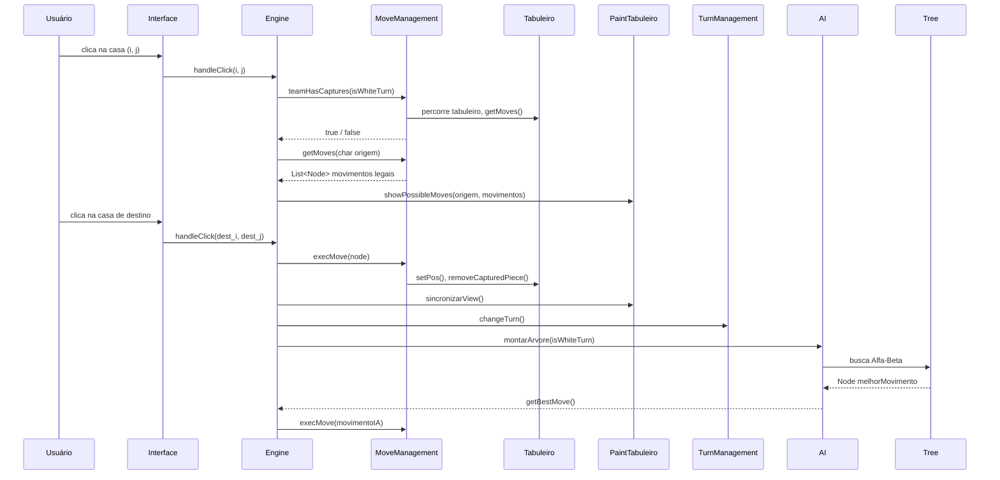
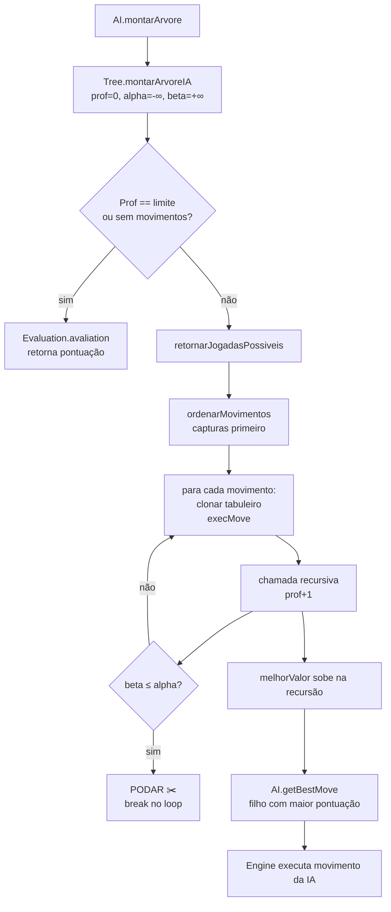

<div align="center">

```

███╗   ██╗ ██████╗ ██████╗ ███████╗███████╗
████╗  ██║██╔═══██╗██╔══██╗██╔════╝██╔════╝
██╔██╗ ██║██║   ██║██████╔╝███████╗█████╗  
██║╚██╗██║██║   ██║██╔══██╗╚════██║██╔══╝  
██║ ╚████║╚██████╔╝██║  ██║███████║███████╗
╚═╝  ╚═══╝ ╚═════╝ ╚═╝  ╚═╝╚══════╝╚══════╝

    ██╗  ██╗██╗   ██╗███╗   ██╗████████╗
    ██║  ██║██║   ██║████╗  ██║╚══██╔══╝
    ███████║██║   ██║██╔██╗ ██║   ██║   
    ██╔══██║██║   ██║██║╚██╗██║   ██║   
    ██║  ██║╚██████╔╝██║ ╚████║   ██║   
    ╚═╝  ╚═╝ ╚═════╝ ╚═╝  ╚═══╝   ╚═╝   
     ◄ HATI  •  SKÖLL  •  FENRIR ►  
```


### 🐺  Motor de IA para Damas**
**Versão 2.0** | *Três lobos. Um tabuleiro. Sem piedade.*

[]()
[]()
[]()
[]()

</div>

---

# Checkers Intelligence

> Jogo de Damas em Java num tabuleiro 6×6 com motor de IA completo, desenvolvido para uma disciplina de Inteligência Artificial — com poda Alfa-Beta, heurística posicional de 5 termos, três níveis de dificuldade representados por lobos da mitologia nórdica e interface gráfica em Swing.

---

## 🎮 Visão Geral

**NORSE HUNT** é um projeto acadêmico de IA que implementa um jogo de Damas totalmente jogável num tabuleiro 6×6 reduzido. O projeto tem dois pilares:

1. **Engine do jogo com as regras de movimentos** — captura obrigatória, capturas múltiplas, promoção a dama, controle de turnos e interface gráfica em Swing.
2. **IA competitiva** — Minimax com poda Alfa-Beta com 3 heurísticas configuráveis por nível de dificuldade.

O nome NORSE HUNT vem da mitologia nórdica: **Hati**, **Sköll** e **Fenrir** são lobos que perseguem o sol e a lua pelo céu. No jogo, eles representam níveis crescentes de dificuldade.

**Funcionalidades principais:**
- Tabuleiro gráfico 6×6 interativo em Java Swing
- Interface de clique com feedback visual (amarelo = selecionado, cinza = destinos válidos, vermelho = inimigos capturáveis)
- Suporte completo a movimento de damas e capturas múltiplas
- Captura obrigatória aplicada com regra
- Promoção a dama ao alcançar a última fileira adversária
- IA com profundidade e heurística configuráveis por nível de dificuldade
- Três níveis de dificuldade: **HATI** (fácil) · **SKÖLL** (médio) · **FENRIR** (difícil)

---

## 🐺 Níveis de Dificuldade

Os três lobos definem como a IA pensa — cada um é mais difícil de vencer porque enxerga mais longe e avalia o tabuleiro com mais cuidado.

| Nível | Lobo | Profundidade |       Heurística       | Estilo de Jogo                                                                                                        |
|:-----:|:----:|:------------:|:----------------------:|:----------------------------------------------------------------------------------------------------------------------|
| 😊 Fácil | **HATI** | 4 |  `QuantityEvaluation`  | Conta apenas peças. Faz movimentos básicos sem planejar. Indicado para iniciantes.                                    |
| 😤 Médio | **SKÖLL** | 10 | `OffensiveEvaluation`  | Avaliação por proximidade da peça ser promovida e diferença de material. Agressivo, mas não muito esperto.            |
| 💀 Difícil | **FENRIR** | 14 | `PositionalEvaluation` | Heurística completa de 5 termos: material, posição, mobilidade, ameaças e vulnerabilidade. Joga de forma estratégica. |

### Por que esses três lobos?

```
Mitologia Nórdica:
  Hati   — persegue a lua, o mais jovem dos lobos. Ansioso, mas previsível.
  Sköll  — persegue o sol, implacável e mais veloz. Difícil de escapar.
  Fenrir — o grande lobo, acorrentado pelos próprios deuses.
```

No jogo, os lobos aparecem como personagens em pixel art na tela de seleção de dificuldade. Escolher um lobo significa escolher o seu oponente.

---

## 🏗️ Arquitetura

### Visão de Alto Nível

```
┌─────────────────────────────────────────────────────┐
│                   Camada de Visão                   │
│   Interface (JFrame) · PaintTabuleiro · CasaBotao   │
│                    MenuScreen · PopUp               │
└────────────────────────┬────────────────────────────┘
                         │ eventos / chamadas de renderização
┌────────────────────────▼────────────────────────────┐
│                  Camada de Motor                    │
│  Engine (coordenador) · MoveManagement              │
│  TurnManagement · PromotionManagement · Translator  │
└────────────────────────┬────────────────────────────┘
                         │ leitura / escrita
┌────────────────────────▼────────────────────────────┐
│                  Camada de Modelo                   │
│           Tabuleiro · Position · Node               │
└─────────────────────────────────────────────────────┘
                         ▲
┌────────────────────────┴────────────────────────────┐
│                   Camada de IA                      │
│   AI · Tree (Alfa-Beta) · Evaluation (abstrata)    │
│      QuantityEvaluation · PositionalEvaluation      │
└─────────────────────────────────────────────────────┘
```

### Componentes Principais

| Classe | Pacote | Responsabilidade |
|---|---|---|
| `Main` | raiz | Ponto de entrada; inicializa `Tabuleiro`, `CasaBotao[][]`, `Engine`, `Interface` e o menu |
| `Tabuleiro` | Model | Tabuleiro 6×6 em `char[][]`. Constantes de peças, inicialização, clonagem, verificações de limites e consultas de tipo |
| `Position` | Model | Objeto de valor (linha, coluna) com `equals`/`hashCode` corretos para uso como chave em `HashMap` |
| `Node` | Model | Representa um movimento como `(origem char, destino char)` + snapshot opcional do tabuleiro + pontuação MinMax + lista de filhos |
| `Engine` | Engine | Coordenador central: eventos de clique, aplicação da captura obrigatória, disparo do turno da IA, detecção de fim de jogo |
| `MoveManagement` | Engine | Geração de movimentos legais (peças simples e damas), execução de movimentos, detecção e remoção de capturas |
| `TurnManagement` | Engine | Alternância de turnos; detecta fim de jogo quando um lado fica sem peças |
| `PromotionManagement` | Engine | Promove a peça a dama ao alcançar a fileira adversária |
| `Translator` | Engine | HashMap bidirecional mapeando casas escuras ↔ caracteres alfabéticos (`A`–`R`) |
| `GameOverListener` | Engine | Interface funcional; callback invocado ao fim do jogo |
| `Interface` | View | `JFrame` com `GridLayout` 6×6, listeners de clique nas casas escuras e diálogo de vencedor |
| `MenuScreen` | View | *(planejado)* Tela de seleção de dificuldade com pixel art dos lobos |
| `PaintTabuleiro` | View | Coloração das casas (amarelo/cinza/vermelho) e renderização dos ícones de peças |
| `CasaBotao` | View | `JButton` customizado para cada casa do tabuleiro |
| `PopUp` | View | Easter egg: quando as brancas ficam com apenas 1 peça, oferece uma peça extra em troca de assistir a um vídeo do IF |
| `AI` | AI | Orquestra a busca: limpa a árvore, chama `Tree.montarArvoreIA` e retorna o melhor movimento |
| `Tree` | AI | Busca Alfa-Beta recursiva. Armazena apenas os filhos de profundidade 0 na RAM; avalia todos os nós mais profundos inline |
| `Evaluation` | AI.Evaluation | Classe base abstrata para funções heurísticas |
| `QuantityEvaluation` | AI.Evaluation | Heurística por material: `(pretasSimples × 10 + pretasDamas × 50) − (equivalente branco)` |
| `PositionalEvaluation` | AI.Evaluation | Heurística de 5 termos: material, tabelas posicionais, mobilidade, ameaças de captura e vulnerabilidade |

---

## 🧠 Design da IA

### Algoritmo: Minimax com Poda Alfa-Beta

A IA utiliza o **algoritmo Minimax** — uma busca clássica em árvore de jogo que assume que ambos os jogadores jogam de forma ótima. As pretas maximizam a pontuação; as brancas minimizam. Sem poda, o Minimax visita todos os nós da árvore, que cresce exponencialmente com a profundidade.

A **poda Alfa-Beta** elimina ramos que nunca podem influenciar a decisão final:

- **Alpha** — melhor valor que o Maximizador (pretas) já garantiu. Nunca diminui.
- **Beta** — melhor valor que o Minimizador (brancas) já garantiu. Nunca aumenta.
- **Condição de corte:** quando `beta ≤ alpha`, o ramo atual é abandonado imediatamente.

```
Sem Alfa-Beta na profundidade 14: ~50.000.000 nós
Com Alfa-Beta na profundidade 14:    ~500.000 nós   (100× menos)
```

### Funções Heurísticas

#### `QuantityEvaluation` — Usada por HATI

```
pontuação = (pretasSimples × 10 + pretasDamas × 50) − (brancasSimples × 10 + brancasDamas × 50)
```

Simples e rápida. Positivo = pretas estão vencendo; negativo = brancas estão vencendo.

### `OffensiveEvaluation` - Usada por SKÖLL

** EM DESENVOLVIMENTO **

#### `PositionalEvaluation` — Usada por FENRIR

Cinco termos ponderados combinados numa única pontuação:

```
pontuação = (materialPretas − materialBrancas)           × 1
          + (posicaoPretas  − posicaoBrancas)            × 2
          + (mobilidadePretas − mobilidadeBrancas)       × 1
          + (ameacasPretas  − ameacasBrancas)            × 3
          + (vulneraveisBrancas − vulneraveisPretas)     × 2
```

| Termo | O que mede |
|-------|-----------|
| **Material** | Peças × 100, Damas × 175. Perder uma peça é sempre custoso. |
| **Posição** | Cada casa tem uma pontuação nas tabelas posicionais abaixo. Avançar e controlar o centro é recompensado. |
| **Mobilidade** | Número de movimentos disponíveis. Mais opções = mais controle. |
| **Ameaças de captura** | Quantas capturas estão disponíveis agora. Pressão ofensiva. |
| **Vulnerabilidade** | Quantas das suas peças podem ser capturadas no próximo movimento do adversário. Consciência defensiva. |

**Tabelas posicionais** (peças pretas avançam da linha 0 → linha 5; brancas são espelhadas verticalmente):

```
Bônus por casa para peças pretas:
  Linha 0:  0  0  0  0  0  0   ← fileira de origem (sem bônus)
  Linha 1:  0  1  1  1  1  0
  Linha 2:  0  2  3  3  2  0
  Linha 3:  0  3  4  4  3  0   ← centro
  Linha 4:  0  4  5  5  4  0
  Linha 5:  0  5  6  6  5  0   ← fileira de promoção
```

Damas não recebem bônus posicional — elas são valiosas em qualquer casa do tabuleiro.

### Profundidades por Dificuldade

```
HATI   — profundidade  8  →  resposta rápida, planejamento raso
SKÖLL  — profundidade 10  →  jogo sólido, pune erros simples
FENRIR — profundidade 14  →  jogo estratégico completo, muito difícil de vencer
```

---

## 🗂️ Fluxo de Dados — Clique do Jogador



---

## 🗺️ Fluxo de Dados — Turno da IA



---

## 📋 Codificação do Tabuleiro

Apenas as 18 casas escuras do tabuleiro 6×6 são jogáveis. O `Translator` atribui a cada uma um rótulo alfabético:

```
  Col: 0    1    2    3    4    5
Lin 0: .    A    .    B    .    C
Lin 1: D    .    E    .    F    .
Lin 2: .    G    .    H    .    I
Lin 3: J    .    K    .    L    .
Lin 4: .    M    .    N    .    O
Lin 5: P    .    Q    .    R    .
```

Um movimento é armazenado como dois valores `char` — ex.: `Node('M', 'G')` significa "peça em M move para G".

### Codificação das Peças

| Valor (`char`) | Peça |
|:-:|:---|
| `'0'` | Casa vazia |
| `'1'` | Peça branca |
| `'2'` | Peça preta |
| `'3'` | Dama branca |
| `'4'` | Dama preta |

---

## 📁 Estrutura do Projeto

```
damas/
├── src/
│   ├── Main.java                           # Ponto de entrada
│   ├── Model/
│   │   ├── Tabuleiro.java                  # Tabuleiro char[][] 6×6
│   │   ├── Position.java                   # Objeto de valor (linha, coluna)
│   │   └── Node.java                       # Movimento + nó da árvore + pontuação MinMax
│   ├── Engine/
│   │   ├── Engine.java                     # Coordenador central / handler de cliques
│   │   ├── MoveManagement.java             # Geração e execução de movimentos
│   │   ├── TurnManagement.java             # Controle de turno e fim de jogo
│   │   ├── PromotionManagement.java        # Promoção a dama
│   │   ├── Translator.java                 # Mapeamento bidirecional casa ↔ char
│   │   └── GameOverListener.java           # Interface funcional de fim de jogo
│   ├── View/
│   │   ├── Interface.java                  # Janela principal JFrame
│   │   ├── MenuScreen.java                 # (planejado) Menu de seleção de lobo
│   │   ├── PaintTabuleiro.java             # Renderização do tabuleiro e destaques
│   │   ├── CasaBotao.java                  # JButton customizado por casa
│   │   └── PopUp.java                      # Easter egg com popup do IF
│   └── AI/
│       ├── AI.java                         # Orquestrador da IA
│       ├── Tree.java                       # Árvore de busca Alfa-Beta
│       ├── MinMax.java                     # MinMax legado (apenas referência)
│       └── Evaluation/
│           ├── Evaluation.java             # Classe base abstrata para heurísticas
│           ├── QuantityEvaluation.java     # Heurística por material (HATI / SKÖLL)
│           └── PositionalEvaluation.java   # Heurística de 5 termos (FENRIR)
├── img/
│   ├── HATI_.png                           # Pixel art do lobo — HATI (não selecionado)
│   ├── HATI_escolhido.png                  # Pixel art do lobo — HATI (selecionado)
│   ├── skoll_escolhido.png                 # Pixel art do lobo — SKÖLL
│   ├── fenrir_01.png                       # Pixel art do lobo — FENRIR (não selecionado)
│   ├── fenrir_02_escolhido.png             # Pixel art do lobo — FENRIR (selecionado)
│   ├── fenrir_03.png                       # Pixel art do lobo — FENRIR variante
│   └── icone_desktop.png                   # Ícone da aplicação
├── out/production/damas/                   # Arquivos .class pré-compilados
├── RELATORIO_TECNICO_AUDITORIA.md          # Relatório técnico de auditoria de performance
├── sugestoes.md                            # Lista de TODOs do desenvolvedor
├── damas.iml                               # Arquivo de módulo do IntelliJ
├── LICENSE                                 # Licença MIT
└── .gitignore
```

---

## 🚀 Como Executar

### Pré-requisitos

- **Java JDK 11 ou superior** (Swing já vem incluído — nenhuma biblioteca externa necessária)
- **IntelliJ IDEA** (recomendado) ou qualquer IDE / terminal com `javac`

```bash
java -version   # deve ser 11+
javac -version
```

### Instalação e Execução

```bash
# 1. Clone ou extraia o projeto
git clone <url-do-repositório>
cd damas

# 2. Compile todos os fontes
javac -d out/production/damas \
      src/Main.java \
      src/Model/*.java \
      src/Engine/*.java \
      src/View/*.java \
      src/AI/*.java \
      src/AI/Evaluation/*.java

# 3. Execute
java -cp out/production/damas Main
```

### Executando pelo IntelliJ IDEA

1. **File → Open** → selecione a pasta `damas/`.
2. Marque `src/` como **Sources Root** caso não seja detectado automaticamente.
3. Clique com o botão direito em `Main.java` → **Run 'Main.main()'**.

---

## 🎯 Como Jogar

1. **Peças brancas** (fileiras de baixo) sempre movem primeiro.
2. **Clique numa peça** para selecioná-la — ela fica amarela; destinos válidos ficam cinza; inimigos capturáveis ficam vermelhos.
3. **Clique num destino** para mover. Clique na mesma peça para desselecionar.
4. **Captura obrigatória:** se qualquer captura estiver disponível, você é obrigado a capturar — movimentos simples são bloqueados.
5. **Captura múltipla:** após capturar, se a mesma peça puder capturar novamente, ela deve continuar.
6. **Promoção:** uma peça que alcança a última fileira adversária vira dama (move qualquer distância na diagonal em todas as 4 direções).
7. O jogo termina quando um lado fica com **0 peças**. Um diálogo anuncia o vencedor.

---

## 📜 Referência das Regras

| Regra | Descrição |
|---|---|
| Captura obrigatória | Se qualquer peça puder capturar, você deve capturar — movimentos simples são bloqueados |
| Movimento apenas para frente | Peças simples só se movem em direção à fileira adversária |
| Captura múltipla | Após capturar, se a mesma peça puder capturar novamente, deve continuar |
| Movimento da dama | Damas se movem qualquer número de casas na diagonal em qualquer direção |
| Captura da dama | Damas capturam em qualquer direção diagonal e continuam capturas múltiplas |
| Pouso da dama | Após capturar, a dama pousa imediatamente após a peça capturada |
| Promoção | Uma peça que alcança a fileira adversária é imediatamente promovida a dama |
| Fim de jogo | O jogador sem peças restantes perde |

---

## 🗺️ Roadmap

| Funcionalidade | Status |
|----------------|--------|
| Poda Alfa-Beta | ✅ Concluído |
| Ordenação de movimentos (capturas primeiro) | ✅ Concluído |
| Heurística posicional de 5 termos | ✅ Concluído |
| Três níveis de dificuldade (HATI / SKÖLL / FENRIR) | 🔄 Em andamento |
| Tela de seleção de lobo | 🔄 Em andamento |
| Make/Undo Move (eliminar `Tabuleiro.clone()`) | 📋 Planejado |
| Zobrist hashing + tabela de transposição | 📋 Planejado |
| Detecção de empate (duas damas, sem captura) | 📋 Planejado |
| IA em thread separada (busca em segundo plano) | 📋 Planejado |
| Reuso incremental da árvore após movimento humano | 📋 Planejado |

---

## 📄 Licença

Este projeto está licenciado sob a **Licença MIT** — veja o arquivo `LICENSE` para detalhes.

---

*Desenvolvido como projeto da disciplina de Inteligência Artificial — Instituto Federal (IF), 2026.*
*Três lobos. Um tabuleiro. Sem piedade.*
